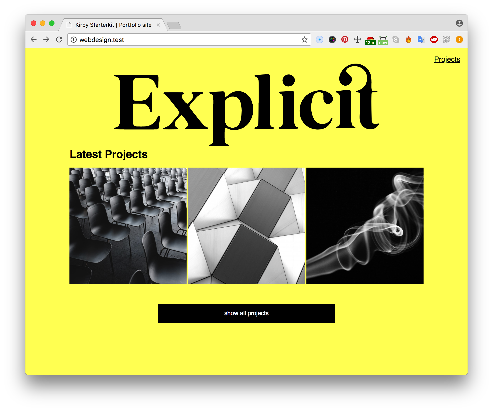

# Portfolio website

In this repo I created a portfolio website for my own projects.

## Interface Design Principles
* #11: Strong visual hierarchies work best
* #12: Smart organization reduces cognitive load
* #16: A crucial moment: the zero state

## Testing
###Iteration #1
Feedback from Cas:
* Button on the top 'projects' doesn't have that much attention.
* Why do you have two links to the same page? 'Projects' and 'Show all projects' are leading you to the same project page.
* You can add a transition on the hover state of the projects
* Why is it saying 'Explicit'?

Feedback from :
*
*
*

Things I changed:
*
*
