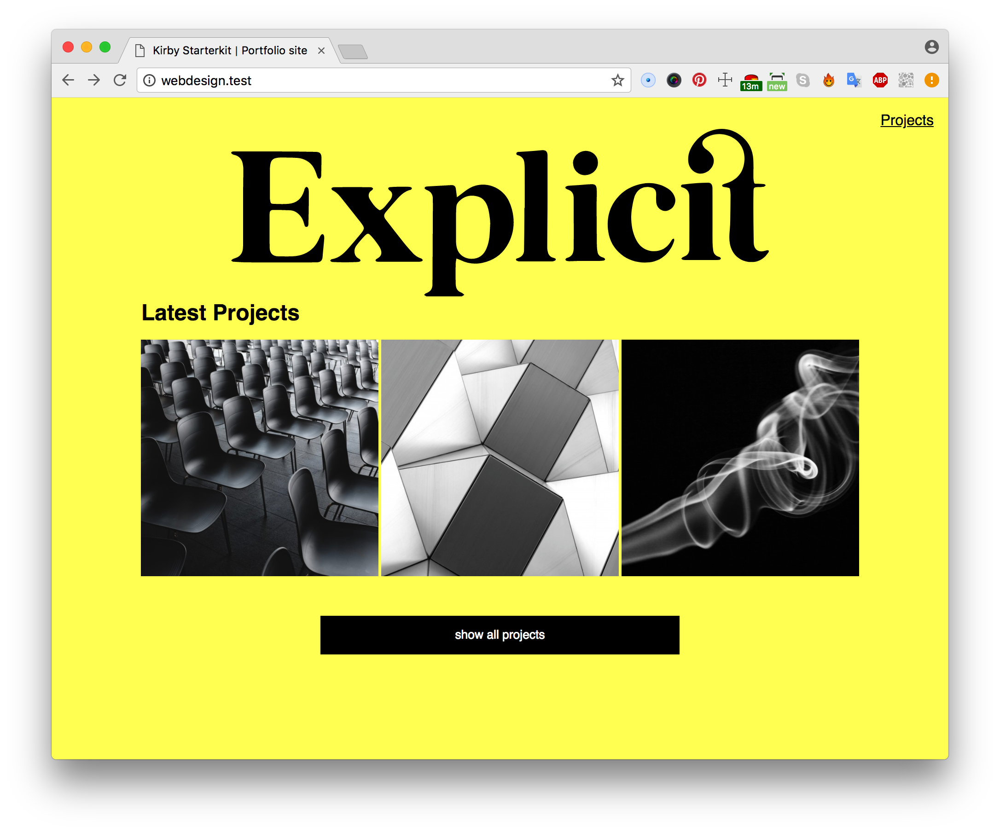
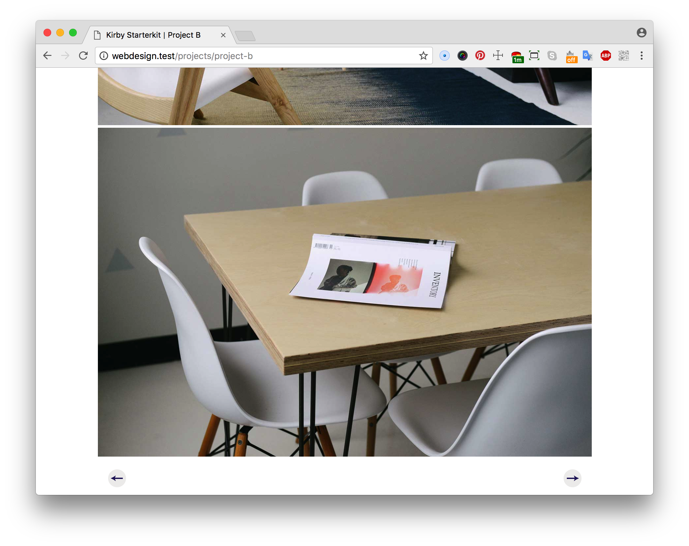

# Portfolio website

In this repo I created a portfolio website for my own projects to show my future clients who I am and what I'm proud of. Notice: the content is not from my own yet.

Live demo [here](http://suuscharlotte.nl/MAPPEN/webdesign).

## Interface Design Principles
For this assignment I have keep in mind three interface design principles:

* #1: Clarity is job number 1. By keeping my interface clean and simple users know immediately what the site is all about. Explicit is now a mockup text, this should be my name. By only having my logo and 3 projects on the site, the first screen gives the user an overview about this website.

* #11: Strong visual hierarchies work best:
By making the background color really extreme, the other elements on the side are in black and white. The projects pictures and the logo are pretty big, to get their attention.

* #8: Provide a natural next step.
When you are in a specific project, you are able to visit the next or previous project by the end of reading the article.

## Testing
Feedback from Cas:
* Button on the top 'projects' doesn't have that much attention.
* Why do you have two links to the same page? 'Projects' and 'Show all projects' are leading you to the same project page.
* You can add a transition on the hover state of the projects
* Why is it saying 'Explicit'?

Feedback from Werner:
* I think the yellow color is nice in combination with the black and white. But I'm not sure if this what you are like.
* The website is a little bit boring.. Same portfolio as most of them.
* Navigation is not right, back button?

So after the feedback I changed first a few things. I added a back button and checked the CSS transition Cas told me about. After that I wasn't satisfied at all. So I decided that I will throw this project aways and start a new one... Check [the new portfolio site](https://github.com/s44s/web-design/tree/master/portfolio-week2)!
