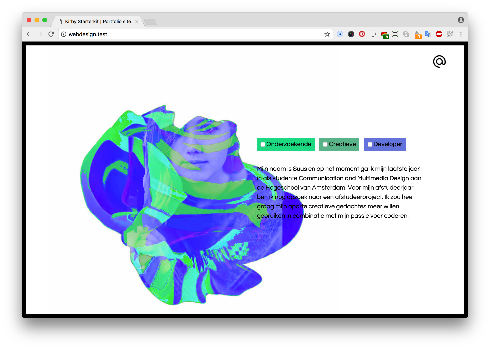
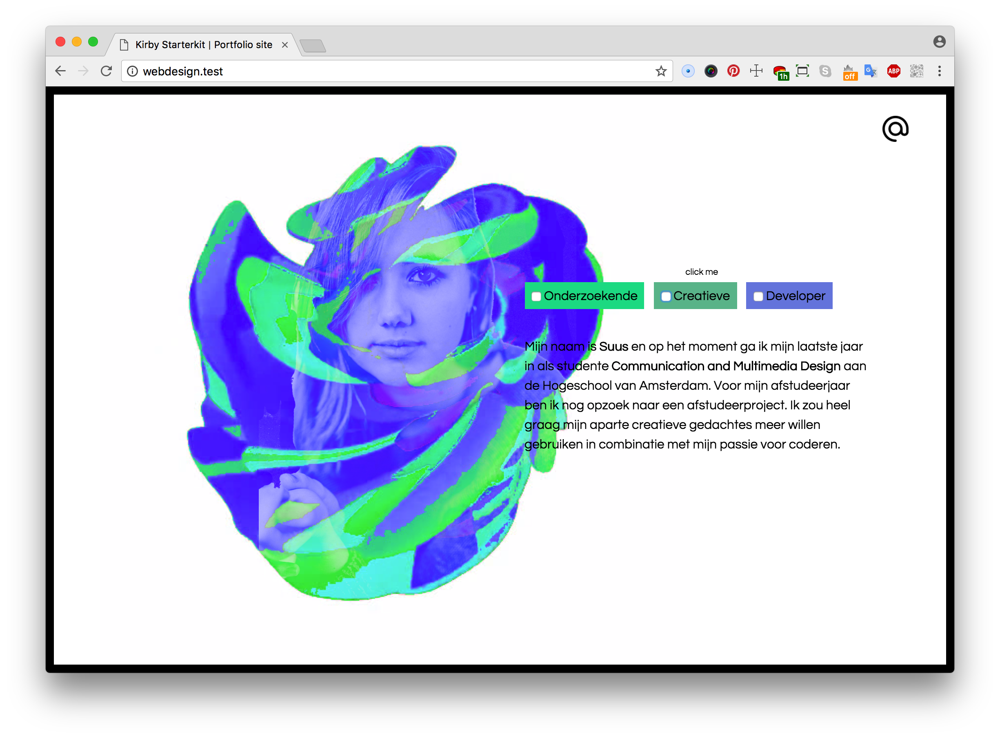
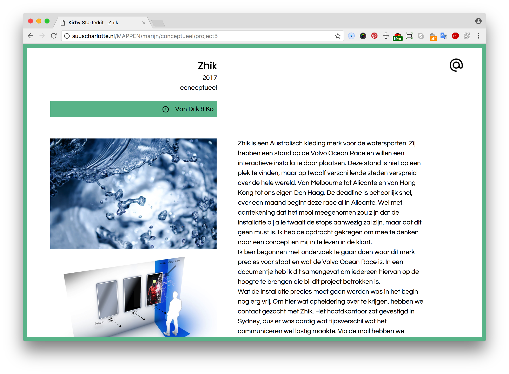

# Portfolio website

In this repo I created a (portfolio) website to show the world who I am. It is not a portfolio site you are used to. By choosing a way of my skills, you will see some of my projects and skills.

## Features
* Page transitions: [Animsit](http://git.blivesta.com/animsition/)

## For who?
The visitors of my website will probably be 'my future clients'. They have heard about my website or find me on the internet and want to know more about me and my projects. They hope to find more information to make a decision if I will be the right person for their project. When they are impressed, they want to make an appointment to know more about me.

The user wants to achieve his goal(s). The goal to know enough to make a decision if I will match with the client, or not. When a client will be impressed by my work, their goal could be to get in touch with me. To make achieving this goal as easy as possible, I will help the user. By giving them a road through the website, they will get to know exactly what they need to make their decision.

### Second user
Marijn is my second user for this case, he is a chief technical architect of a large tech company in the music industry. He is severely motor impaired, it takes him quite some effort to have a little control over his muscles. To make my website compatible also for people like him, I'm trying to add clear focus states.

The 18th of April I'm going to meet Marijn for the first time. I have came up with some question for him:
- You said that typing is really hard. How do you fill in a form normally? Do you use a microphone? What could I do if I want to use a form in my website?
- Do you prefer the focus state of the browser or a custom focus state?
- I really like to know, if you have to hire one new employee, what is for you most important?
- If you look around to portfolio websites, which are in your opinion 'good' and why?

## User scenario's
Marijn is looking for a new employee for his tech company. He received 4 portfolio websites and he only have one day to chose the right person. So he is looking straight for his goal.
* He wants to be impressed when he is visiting the site for the first time. When he will not be impressed he is not looking further.
* After that he wants to find out more about the code qualities of that person.
* If he finds it good enough, he wants to get in touch with that person.
* Besides this, Marijn is only using a keyboard because of his disability. He wants to use the site with the right functionality and pleasure.

## Sitemap and cart sorting
At the homepage you have four different option to explore my site. I'm explaining myself by three keywords An Inquisitive Creative Developer. You can either chose one of those three components, or you can chose them all in one.

## User Interface Principles
#### #04 Keep users in control
> Humans are most comfortable when they feel in control of themselves and their environment. Thoughtless software takes away that comfort by forcing people into unplanned interactions, confusing pathways, and surprising outcomes. Keep users in control by regularly surfacing system status, by describing causation (if you do this that will happen) and by giving insight into what to expect at every turn. Don't worry about stating the obvious…the obvious almost never is.

*Keep the user in control by telling them what they could do. Is it to obvious? The obvious almost never is.*

*Keep the user in control by telling them what will happen next.*

#### #08 Provide a natural next step
> Very few interactions are meant to be the last, so thoughtfully design a next step for each interaction a person has with your interface. Anticipate what the next interaction should be and design to support it. Just as we like in human conversation, provide an opening for further interaction. Don't leave a person hanging because they've done what you want them to do…give them a natural next step that helps them further achieve their goals.

*When you are in a project page, you can go to the prev or next page.*

#### #14 Progressive Disclosure
> Show only what is necessary on each screen. If people are making a choice, show enough information to allow them the choice, then dive into details on a subsequent screen. Avoid the tendency to over-explain or show everything all at once. When possible, defer decisions to subsequent screens by progressively disclosing information as necessary. This will keep your interactions more clear.

* Homepage: navigation
* Project pages: chose a project
* Project detail page: information and chose next
* Contact page: send me a song!

## Test
* Date: *25 april 2018*
* Where: *Hogschool van Amsterdam*
* Who: *Marijn*

Marijn used his own laptop (macbook pro). In the accessibility settings he enabled the 'sticky keys' option. Before this test we didn't even meet Marijn before. So his friend Vasilis told us that Marijn used the tab key most of the times. In fact, the opposite is true. Martijn uses most of the time his trackpad and the space bar. He uses the spacebar to scroll and to click on items.

### To Do
- [ ] Contact page (working backend)
- [ ] Responsive on all devices
- [ ] Feature detection
- [ ] Performance check
- [ ] Dot navigation
- [ ] Back button
